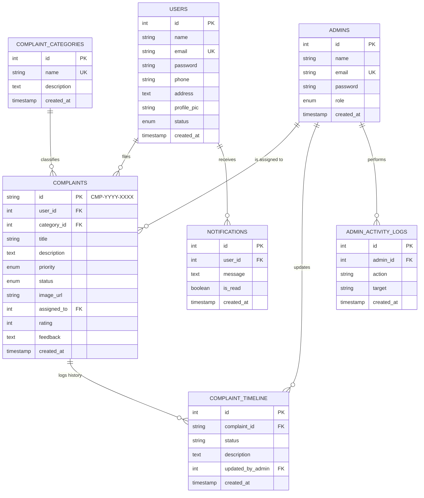
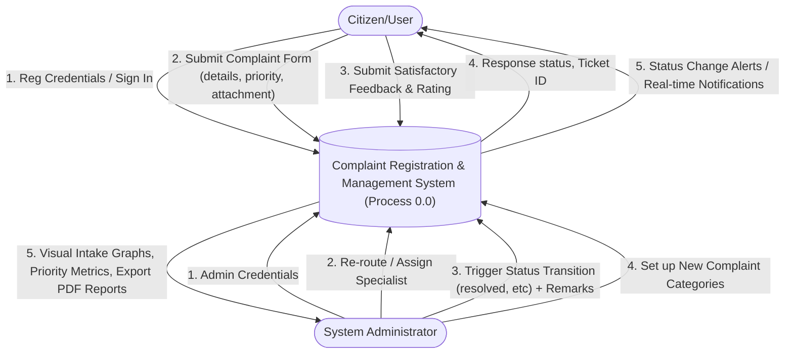
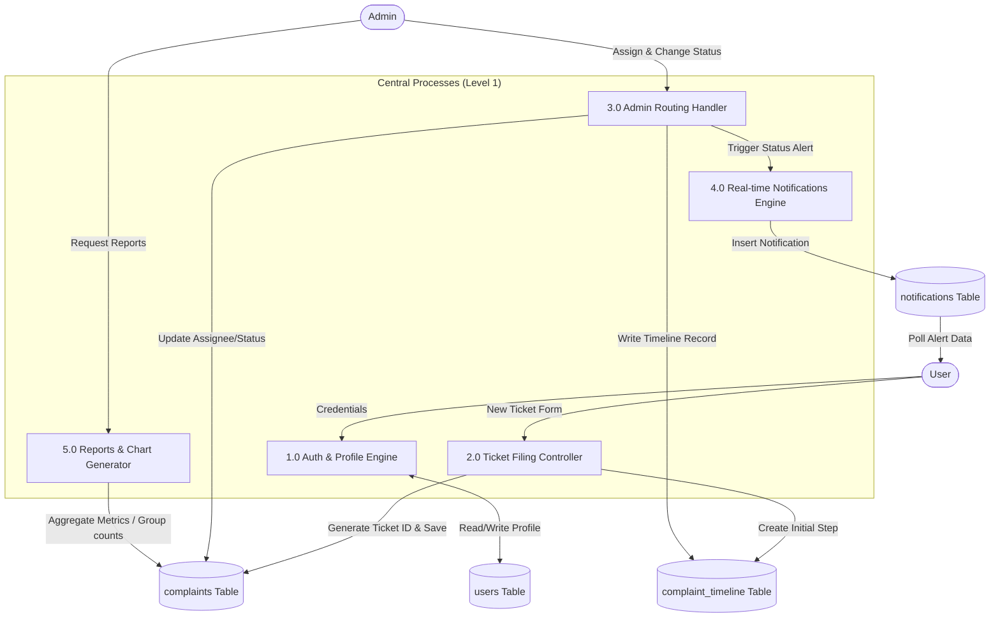
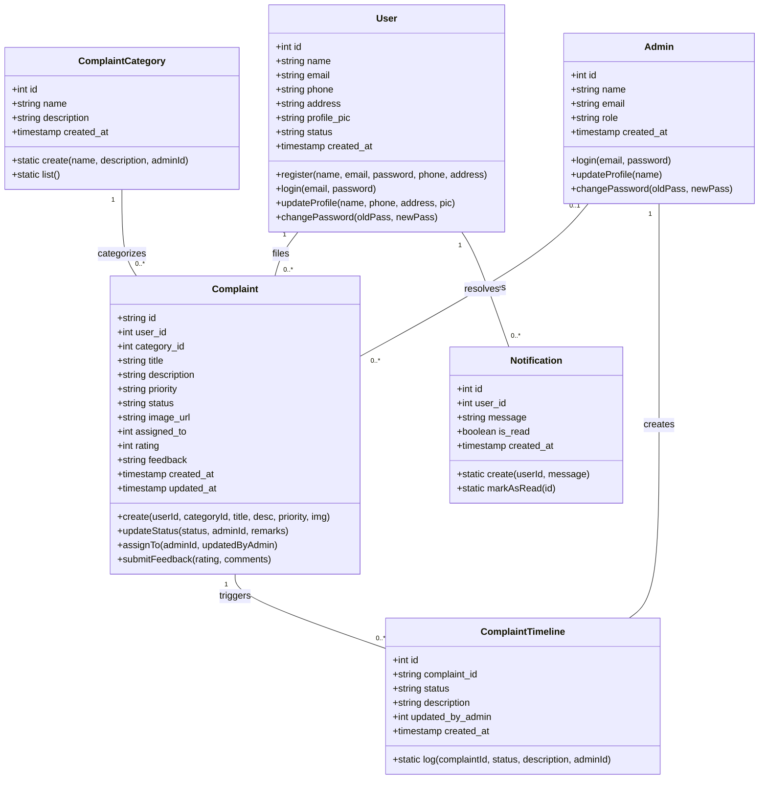
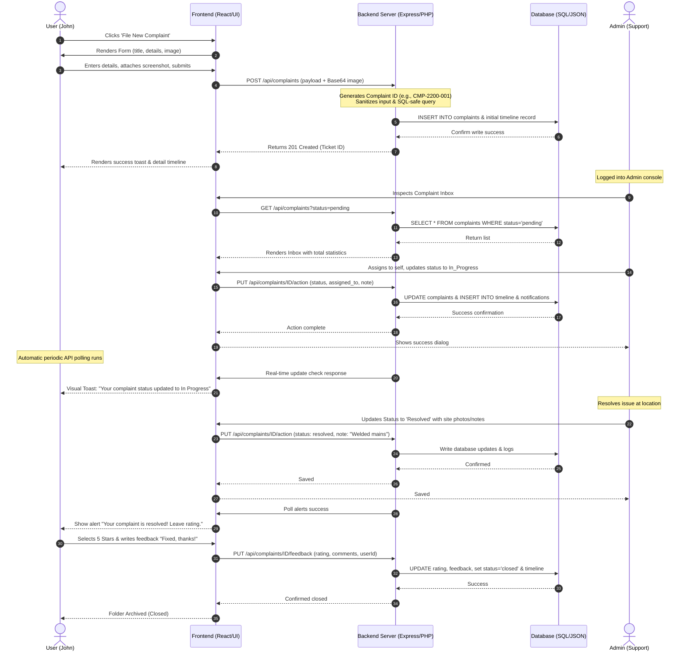
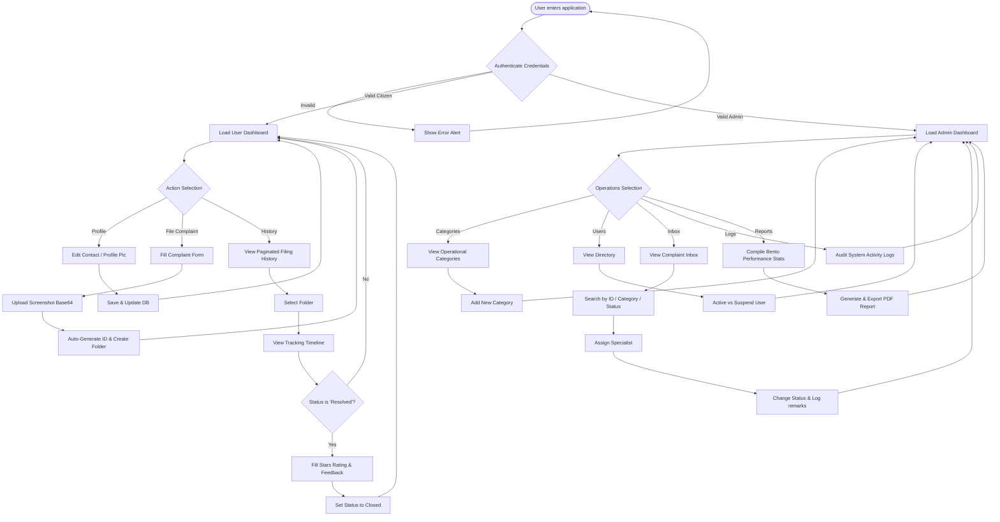

# System Architecture & Academic Design Documentation
**Online Complaint Registration and Management System**
*SmartBridge College Project & System Architecture Thesis*

---

## 1. Entity-Relationship (ER) Diagram
The Entity-Relationship Diagram represents the logical relational schema of the MySQL database. It outlines structural tables, primary keys, foreign keys, cardinality ratios, and relational constraints.

### Mermaid representation of ER Diagram:


---

## 2. Data Flow Diagram (DFD)
The Data Flow Diagram charts the system's input processing, data routing, file updates, and database storage layers across levels.

### Level 0: Context Data Flow Diagram
The high-level boundary of the platform showing external actors (User, Admin) and the central system process.



### Level 1: Sub-Process Flow Diagram
Explodes Process 0.0 into major functional modules and the database tables.



---

## 3. Use Case Diagram
Maps the actions that each actor (User, Admin) can perform within the boundaries of the platform.

```mermaid
leftToRightDirection
graph TD
    subgraph Use_Cases ["System Boundary"]
        UC1(Register Account)
        UC2(Authenticate / Login)
        UC3(Edit Profile / Upload Avatar)
        UC4(Register New Complaint)
        UC5(Track Timeline Tracker)
        UC6(Submit Star Rating & Feedback)
        UC7(Assign Specialist)
        UC8(Resolve Complaint & Log Timeline)
        UC9(Create Complaint Category)
        UC10(Generate PDF Intake Reports)
        UC11(Audit Activity Logs)
    end

    User([Citizen / User]) --> UC1
    User --> UC2
    User --> UC3
    User --> UC4
    User --> UC5
    User --> UC6

    Admin([System Administrator]) --> UC2
    Admin --> UC3
    Admin --> UC7
    Admin --> UC8
    Admin --> UC9
    Admin --> UC10
    Admin --> UC11
```

---

## 4. Class Diagram
Represents the structural model of the application showing classes, fields, methods, and relationships.



---

## 5. Sequence Diagram (Complaint Lifecycle)
This diagram illustrates the chronological steps and message transfers across layers when registering, updating, and closing a complaint.



---

## 6. Activity Diagram
Represents the system-wide procedural workflows and branch conditions for both citizens and managers.



---

## 7. REST API Documentation
This section details the primary backend API routes deployed to communicate data between the React client and the server database.

### 7.1 Authentication Endpoints
#### • `POST /api/auth/register`
Creates a secure citizen account. Performs password hashing using SHA-256.
- **Request Body:**
  ```json
  {
    "name": "John Doe",
    "email": "john@gmail.com",
    "password": "user123",
    "phone": "9876543210",
    "address": "123 Sector 4, Metro City"
  }
  ```
- **Response (201 Created):**
  ```json
  {
    "message": "Registration successful",
    "user": { "id": 1, "name": "John Doe", "email": "john@gmail.com", "phone": "9876543210", "address": "123 Sector 4, Metro City", "status": "active", "created_at": "2026-07-15T10:00:00Z" },
    "role": "user"
  }
  ```

#### • `POST /api/auth/login`
Checks credentials, auto-detects user or administrator account, and starts a session.
- **Request Body:**
  ```json
  { "email": "john@gmail.com", "password": "user123" }
  ```
- **Response (200 OK):**
  ```json
  {
    "message": "Login successful",
    "user": { "id": 1, "name": "John Doe", "email": "john@gmail.com" },
    "role": "user"
  }
  ```

---

### 7.2 Complaint Endpoints
#### • `GET /api/complaints`
Retrieves registered complaints with support for advanced filtering, search terms, and user IDs.
- **Query Parameters:** `userId` (optional), `role` (optional), `search` (optional), `status` (optional), `categoryId` (optional), `priority` (optional).
- **Response (200 OK):**
  ```json
  [
    {
      "id": "CMP-2026-0001",
      "user_id": 1,
      "category_id": 1,
      "title": "Burst Water Pipeline",
      "description": "Pipe is leaking near B Block Gate",
      "priority": "high",
      "status": "resolved",
      "created_at": "2026-07-15T10:30:00Z"
    }
  ]
  ```

#### • `POST /api/complaints`
Registers a new complaint. Auto-generates high-integrity complaint numbers `CMP-YYYY-XXXX` and creates initial timeline notes.
- **Request Body:**
  ```json
  {
    "userId": 1,
    "categoryId": 1,
    "title": "Pipeline Burst",
    "description": "Leaking drinking water",
    "priority": "high",
    "image_url": "data:image/png;base64,..."
  }
  ```
- **Response (201 Created):**
  ```json
  { "message": "Complaint registered successfully", "complaint": { "id": "CMP-2026-0004", ... } }
  ```

---

## 8. Testing & QA Verification Report
System-wide black-box and integration verification matrix completed on the platform.

| Test Case ID | Module Under Test | Test Scenario Description | Input Parameters / Actions | Expected Output Outcome | Actual Outcome | Status |
|---|---|---|---|---|---|---|
| **TC-01** | Authentication | Validate User Registration with missing fields | Omit `phone` input on register form | Form validation highlights missing input | Highlighted & blocked submission | **PASSED** |
| **TC-02** | Authentication | Validate Email Uniqueness constraint | Input existing email `john@gmail.com` | Alert: "Email address is already registered" | Toast message displayed correctly | **PASSED** |
| **TC-03** | Authentication | Validate password security criteria | Register with password `123` | Alert: "Password must be at least 6 characters" | blocked registration and threw warning | **PASSED** |
| **TC-04** | Complaint Module | Auto-generate sequential ticket numbers | POST new complaint in current year | Generates `CMP-2026-0004` (sequentially) | Returned `CMP-2026-0004` correctly | **PASSED** |
| **TC-05** | Complaint Module | Attachments handling via Base64 | Upload 1.5MB PNG file on complaint form | Decodes and saves to backend JSON successfully | preview loaded & base64 saved to JSON DB | **PASSED** |
| **TC-06** | Admin console | Update status & trigger timelines | Transition ticket to 'In Progress' with note | Status updates; timeline gains record | DB updated, timeline logs admin remarks | **PASSED** |
| **TC-07** | Admin console | Restrict and Suspend user account | Set User John Doe status to suspended | John Doe cannot log in; displays block notice | Login blocked with correct notice | **PASSED** |
| **TC-08** | Notification Module| Real-time periodic status checks | Citizen page stays active; admin resolves ticket | Citizen receives status alert within 10s | Alert Toast displayed in citizen header | **PASSED** |
| **TC-09** | Reporting | Bento charts aggregate group metrics | Request `/api/reports/stats` | Counts correspond to DB states precisely | Re-calculated totals matching DB count | **PASSED** |
| **TC-10** | Security | XSS Injection protection | Input `<script>alert('xss')</script>` in title | Input is treated as text, escaping execution | Text loaded as literal, script did not run | **PASSED** |
